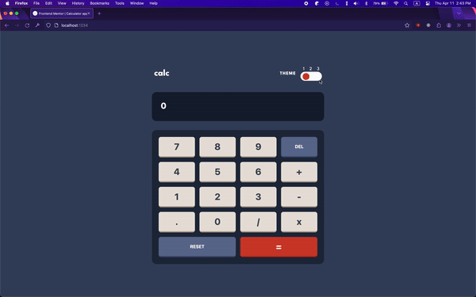
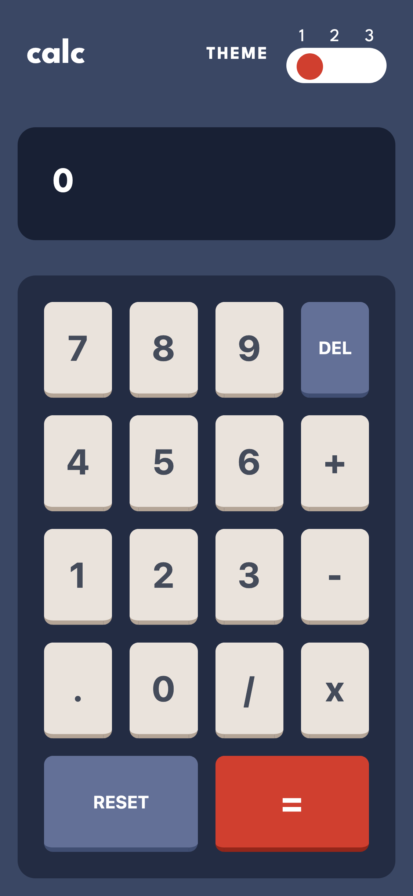

# Frontend Mentor - Calculator app solution

This is a solution to the [Calculator app challenge on Frontend Mentor](https://www.frontendmentor.io/challenges/calculator-app-9lteq5N29). Frontend Mentor challenges help you improve your coding skills by building realistic projects.

## Table of contents

- [Overview](#overview)
  - [The challenge](#the-challenge)
  - [Screenshot](#screenshot)
  - [Links](#links)
- [My process](#my-process)
  - [Built with](#built-with)
  - [What I learned](#what-i-learned)
  - [Continued development](#continued-development)
  - [Useful resources](#useful-resources)
- [Author](#author)

**Note: Delete this note and update the table of contents based on what sections you keep.**

## Overview

### The challenge

Users should be able to:

- See the size of the elements adjust based on their device's screen size
- Perform mathmatical operations like addition, subtraction, multiplication, and division
- Adjust the color theme based on their preference
- **Bonus**: Have their initial theme preference checked using `prefers-color-scheme` and have any additional changes saved in the browser

### Screenshot





### Links

- Solution URL: [Add solution URL here](https://your-solution-url.com)
- Live Site URL: [Add live site URL here](https://your-live-site-url.com)

## My process

### Built with

- Semantic HTML5 markup
- CSS custom properties
- Flexbox
- CSS Grid
- Mobile-first workflow
- SASS
- Parcel

### What I learned

I combined the Odin Project Calculator with Frontend Mentor project. It was challenging to complete this.

To create a calculator, I used the concept of IIFE (Immediately Invoked Function Expression). By doing this, it's similar to Singleton pattern. There is only one calculator and no other calculator can be created again.

The syntax of IIFE is the following:

```js
  const calculator = (function(){const functionA =();
  return {functionA}})();
```

IIFE holds functions and properties necessary for the object. We return an object with access to these properties and functions.

To create the 3 themes, I used SASS that can generate classes for the: light-theme, dark-theme, and purple-theme.

In SASS, we can create maps:

```css
$themes: (
  dark: (
    mainBG: hsl(222, 26%, 31%),
    keypadBG: hsl(223, 31%, 20%),
    screenBG: hsl(224, 36%, 15%),
    keyBG: hsl(30, 25%, 89%),
    keyShadow: hsl(28, 16%, 65%),
    specialKey1: hsl(6, 63%, 50%),
    specialKey1Shadow: hsl(6, 70%, 34%),
    specialKey2: hsl(225, 21%, 49%),
    specialKey2Shadow: hsl(224, 28%, 35%),
    mainText: hsl(0, 0%, 100%),
    textDark: hsl(221, 14%, 31%),
    textLight: hsl(0, 0%, 100%)
  ),
  light: (
    mainBG: hsl(0, 0%, 90%),
    keypadBG: hsl(0, 5%, 81%),
    screenBG: hsl(0, 0%, 93%),
    keyBG: hsl(45, 7%, 89%),
    keyShadow: hsl(35, 11%, 61%),
    specialKey1: hsl(25, 98%, 40%),
    specialKey1Shadow: hsl(25, 99%, 27%),
    specialKey2: hsl(185, 42%, 37%),
    specialKey2Shadow: hsl(185, 58%, 25%),
    mainText: hsl(60, 10%, 19%),
    textDark: hsl(60, 10%, 19%),
    textLight: hsl(0, 0%, 100%)
  ),
  purple: (
    mainBG: hsl(268, 75%, 9%),
    keypadBG: hsl(268, 71%, 12%),
    screenBG: hsl(268, 71%, 12%),
    keyBG: hsl(281, 89%, 26%),
    keyShadow: hsl(285, 91%, 52%),
    specialKey1: hsl(176, 100%, 44%),
    specialKey1Shadow: hsl(177, 92%, 70%),
    specialKey2: hsl(268, 47%, 21%),
    specialKey2Shadow: hsl(290, 70%, 36%),
    mainText: hsl(52, 100%, 62%),
    textDark: hsl(52, 100%, 62%),
    textLight: hsl(0, 0%, 100%)
  )
);
```

These key-value properties can be used to generate theme classes for the HTML elements. (See \_mixin.scss, \_function_scss to see implementation).

I also learned that in Parcel, I can not simply import a .wav file and I need to use URL object to import.

In my brief research, I learned that it's due to related to transformers used in parcel. You can update the configuration file to accept .wav file but you can also just make the wav file as a URL object then use it that way.

### Continued development

The most challenging part of this project was creatign the calculator and integrating with the UI components.

My initial plan was to separate the logic of the calculator and UI components but unfortuantely I had to integrate them together.
Better practice is to separate the logic and UI. The UI main purpose is to simply get user input and display result. But I could not achieve this in a clean way.

Hence, possible future progress is to clean up the code inside index.mjs and keep logic separate.

### Useful resources

- [Themeing in Sass](https://david-x.medium.com/light-mode-dark-mode-dynamic-theming-through-scss-mixin-c86e57a4de49) - This helped me with creating multiple themes in Sass!

## Author

- Frontend Mentor - [@LySabrina](https://www.frontendmentor.io/profile/LySabrina)
- GitHub - [@LySabrina](https://github.com/LySabrina)
